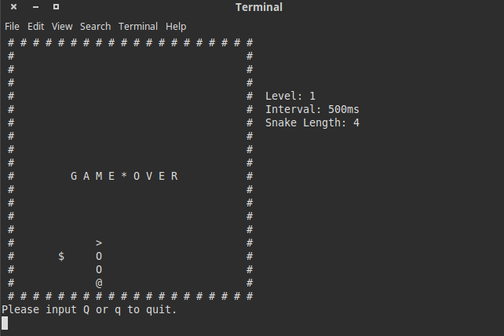
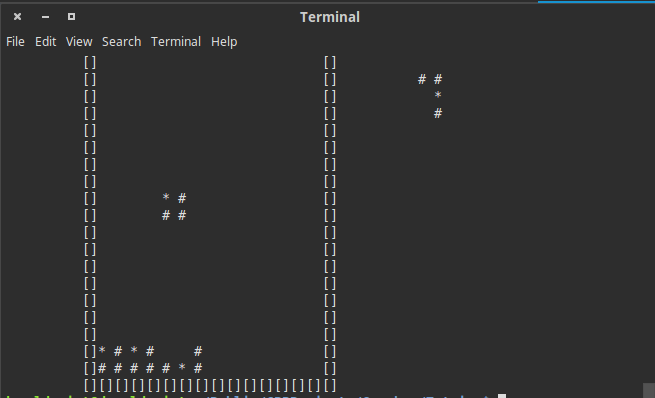

# GameBoy

It is some simple implements of the classic games of [GameBoy](https://en.wikipedia.org/wiki/Game_Boy) by using C\+\+. I played GameBoy when I was a child, it is simple, easy but full of fun. I would keep fixing and expanding this project in my free time. Until now, this project contains:

## Snake(贪吃蛇)

## Tetris(俄罗斯方块)

